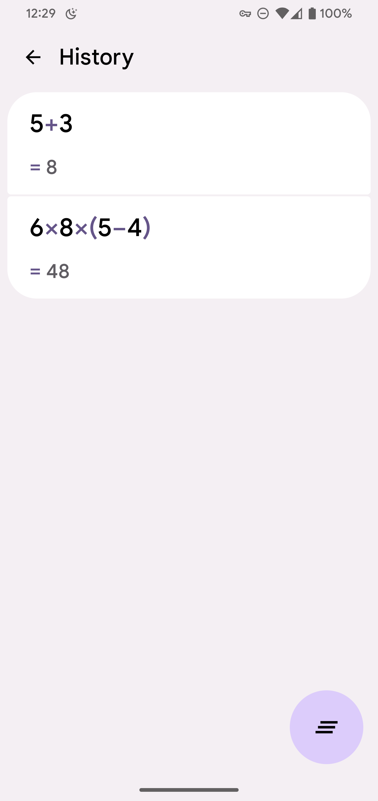

# Kalc

A simple Material You calculator.

## Features

- [x] Built with **Jetpack Compose**, using **ViewModel** as data source
- [x] 🎨 Dynamic color system (press "AC" or "=" button to change color)
- [x] Integration with Android 12 themed icon API & Android 13 launch animation 
- [x] Partially support landscape
- [x] Fully support dark mode
- [x] Calculation history (press "=" button to save expression to history)
- [x] Better nested parentheses support

## TODOs

There are still some bugs to be fixed.
