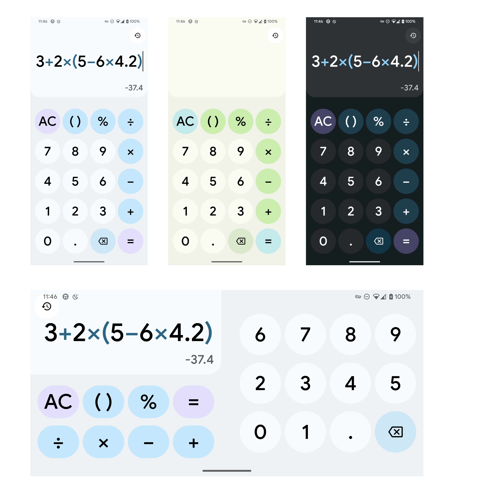
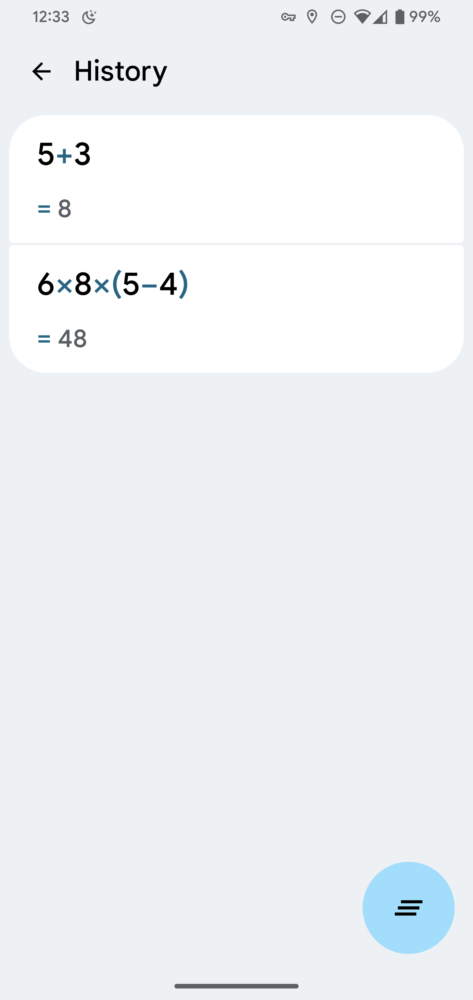

# Kalc

⭐ **Study Jam project** ⭐

A simple Material You calculator.

----

Main screen:

History screen:

## Features

- [x] 😎 Built with **Jetpack Compose**, using **ViewModel** as data source
- [x] 🎨 [Dynamic color system](https://github.com/Kyant0/Kalc/tree/master/app/src/main/java/com/kyant/monet), use color science to create consistent themes (press "AC" or "=" button to change color)
- [x] 💕 Integration with Android 12 themed icon API & Android 13 launch animation 
- [x] 💻 Landscape support
- [x] 🌃 Dark theme support
- [x] 🕑 Calculation history (press "=" button to save expression to history)
- [x] ➕ Better nested parentheses support

## Notices

- This is only a demo application, the calculation may be not accurate and it cannot handle very complex calculations. It cannot be used for the science purpose.
- The main evaluation algorithm is [RPN](https://en.wikipedia.org/wiki/Reverse_Polish_notation), [code here](https://github.com/Kyant0/Kalc/blob/master/app/src/main/java/com/kyant/kalc/math/Evaluator.kt).
- The support of opposite numbers sucks, I use a [FallbackEvaluator](https://github.com/Kyant0/Kalc/blob/master/app/src/main/java/com/kyant/kalc/math/FallbackEvaluator.kt) to operate on them.
- The two algorithms I mentioned above is adapted from RosettaCode.

